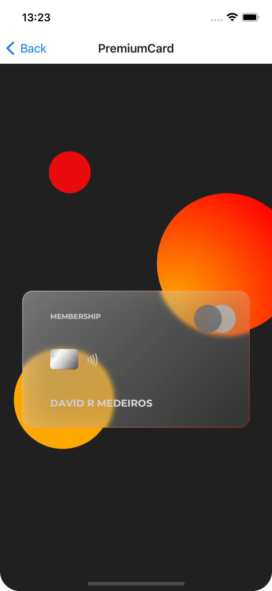

<h1 align="center">
  
</h1>

<h3 align="center"><a target="_blank" href="https://shopify.github.io/react-native-skia/">React Native Skia</a> examples playground</h3>

<h2 align="center">
  
</h2>

<h2 align="center">Open with Expo</h2>

Install Expo client on your device and scan the QR Code

